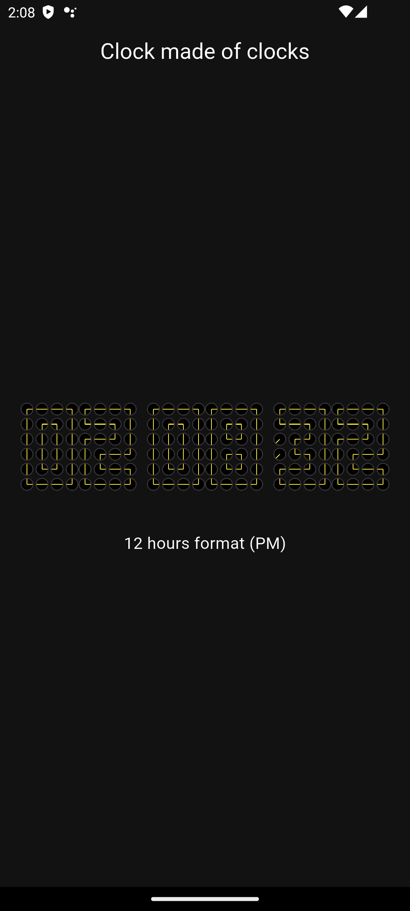
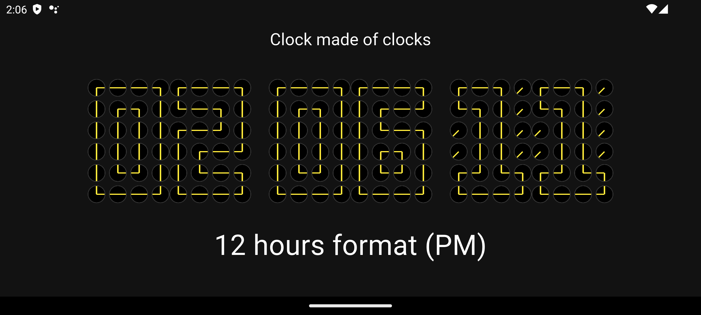

# Clock Made of Clocks ⏰

[](https://github.com/Crisxzu/clock-of-clocks-flutter/actions/workflows/release.yml)

A creative Flutter application that displays the current time using a grid of animated analog clocks. <br/> 
Each digit is composed of 24 mini clocks (4x6 grid) whose hands rotate to form the shape of numbers.

## Inspiration

This project was created as a fun exercise after watching [Hyperplexed's video](https://www.youtube.com/watch?v=VUSCH7nQGIM) about creating unique and whimsical interfaces.<br/> 
I really love this guy's approach on UI and explanations he does. <br/>
So big up to him 😉!

You can check his repo on this [link](https://github.com/githyperplexed/clock-of-clocks)

## Features

- **Animated Clock Display**: Each digit (0-9) is rendered using 24 mini analog clocks
- **Real-time Updates**: The display updates every second to show the current time
- **12/24 Hour Format**: Automatically adapts to the device's time format preference
- **Fully Responsive**: Optimized for mobile, tablet, and desktop screens
- **Orientation Support**: Adapts seamlessly between portrait and landscape modes
- **Multi-platform**: Runs on Android, iOS, Web, Windows, macOS, and Linux
- **Smooth Animations**: Clock hands rotate smoothly with animated transitions

## Screenshots





## Technical Stack

- **Framework**: Flutter 3.8.1+
- **Language**: Dart
- **Dependencies**:
  - `intl` - For internationalization and time formatting
  - `cupertino_icons` - iOS-style icons

## Architecture

The app follows a clean architecture with:
- **Responsive utilities**: Helper functions for adaptive sizing across devices
- **Reusable widgets**: Modular Clock and Digit components
- **State management**: Simple setState for real-time updates
- **Orientation handling**: OrientationBuilder for adaptive layouts

## Getting Started

### Prerequisites

- Flutter SDK (3.8.1 or higher)
- Dart SDK (3.8.1 or higher)
- For mobile: Android Studio/Xcode
- For desktop: Platform-specific requirements (see below)

### Installation

1. Clone this repository:
```bash
git clone https://github.com/Crisxzu/clock-of-clocks-flutter.git
cd clock_app
```

2. Install dependencies:
```bash
flutter pub get
```

3. Run the app:
```bash
flutter run
```

## CI/CD with GitHub Actions

The project includes automated build workflows for all platforms:

### Automated Releases (release.yml)
Creates GitHub Releases with downloadable builds when you tag a version:

```bash
# Create and push a version tag
git tag v1.0.0
git push origin v1.0.0
```

The workflow will:
1. Build all platforms in parallel
2. Create a GitHub Release
3. Upload all builds as release assets

See [.github/README.md](.github/README.md) for detailed CI/CD documentation.

## Internationalization

The app supports English and French:
- Automatic language detection based on device locale
- Fallback to English for unsupported languages
- ARB-based localization system

To add new translations, edit files in `lib/l10n/`:
- `app_en.arb` - English translations
- `app_fr.arb` - French translations

## Project Structure

```
lib/
├── common/
│   ├── constants.dart         # Digit patterns and angle mappings
│   ├── responsive_utils.dart  # Responsive helper functions
│   └── utils.dart             # Utility functions (time formatting, locale)
├── home/
│   ├── home_page.dart         # Main page with time display
│   └── widgets/
│       ├── clock.dart         # Individual analog clock widget
│       └── digit.dart         # Digit composed of 24 clocks
├── l10n/
│   ├── app_en.arb             # English translations
│   ├── app_fr.arb             # French translations
│   └── app_localizations.dart # Generated localization classes
└── main.dart                  # App entry point

.github/
└── workflows/
    └── release.yml            # Automated release creation
```

## How It Works

1. **Digit Mapping**: Each digit (0-9) is mapped to a 4x6 grid of clock positions
2. **Angle Calculation**: Each clock position has two needle angles that form parts of the digit shape
3. **Real-time Updates**: A timer updates every second, parsing the current time
4. **Responsive Rendering**: The UI adapts to screen size and orientation using responsive utilities

## Responsive Design

The app implements comprehensive responsive features:
- Adaptive font sizes based on screen width
- Dynamic spacing and padding
- Tablet-specific optimizations (screens ≥ 600dp)
- BorderRadius and border widths that scale with widget size
- SafeArea support for notches and system bars

## Contributing

This is a practice project, but contributions, issues, and feature requests are welcome!

## Credits

- **Inspiration**: [Hyperplexed](https://www.youtube.com/@Hyperplexed) - Original concept creator
- **Implementation**: Practice project for fun

## License

This project is open source and available under the [MIT License](LICENSE).

## Contact

Feel free to reach out if you have any questions or suggestions!

---

Made by Dazu